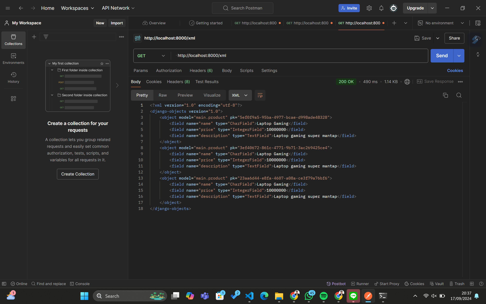
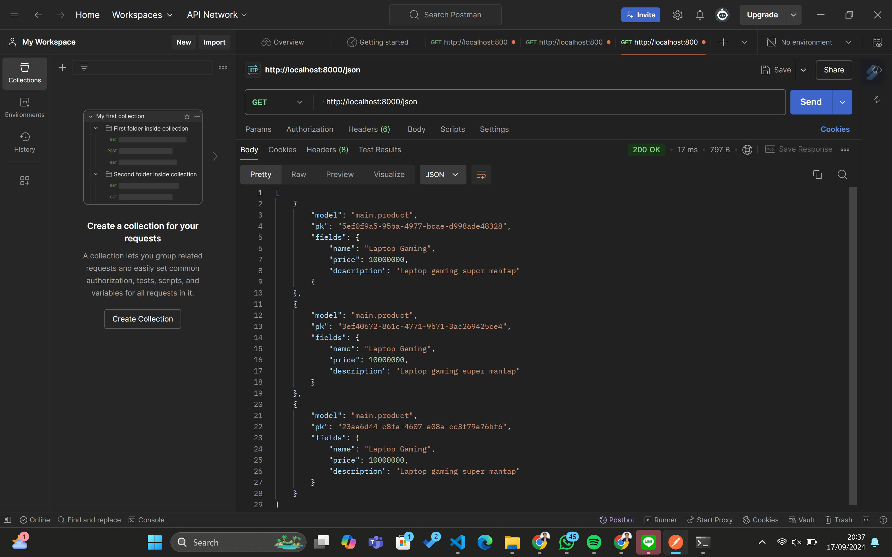
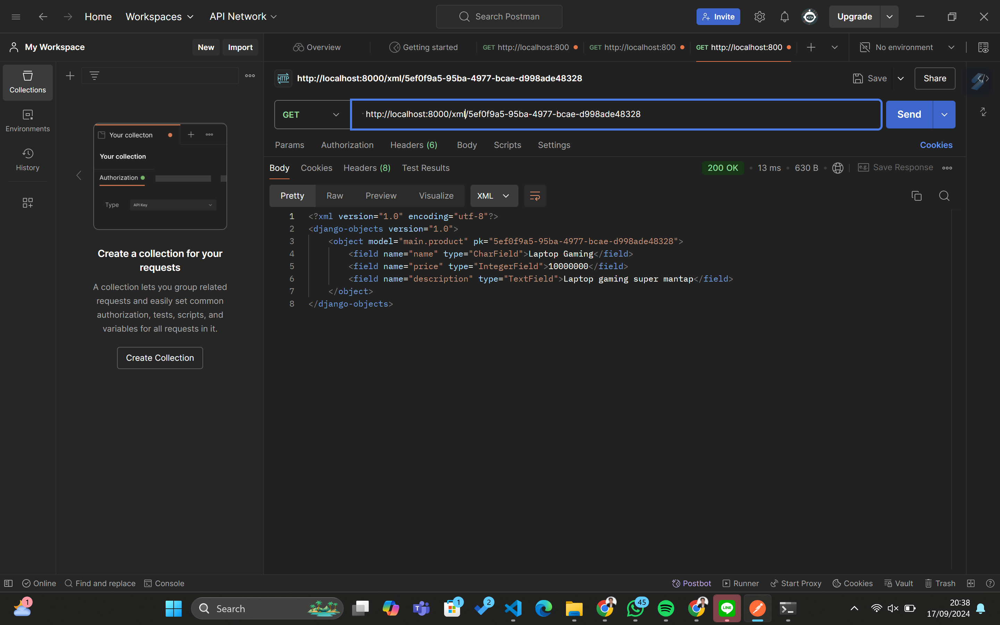
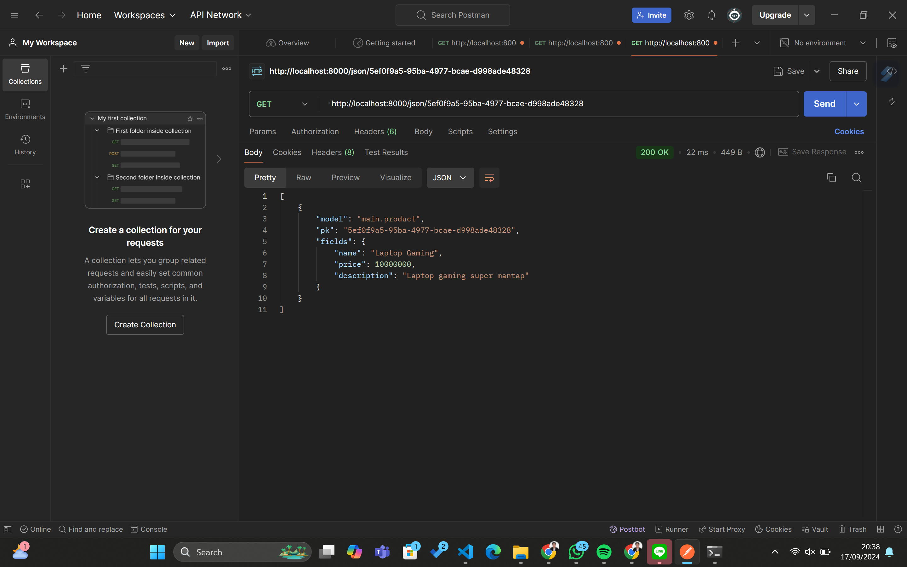

Tautan menuju aplikasi PWS: http://erland-hafizh-pacilshop.pbp.cs.ui.ac.id/

=======================TUGAS 2=======================

[] Cara mengimplementasikan checlist yang ditugaskan secara step-by-step
1) Langkah pertama untuk membuat sebuah proyek Django baru adalah dengan membuat direktori utama lokal baru. Setelah itu, kita harus membuat virtual environment dan mengaktifkannya. Setelah virtual environment berhasil terbuat dan menyala, kita perlu membuat berkas requirements.txt di dalam direktori yang sama yang berisi beberapa dependencies. Setelah itu, kita harus melakukan instalasi terhadap dependencies yang berada pada file .txt sebelumnya. Setelah selesai, baru kita dapat membuat proyek Django dengan menjalankan perintah 'django-admin startproject (nama project) .'.
2) Untuk membuat aplikasi dengan nama main, kita perlu menjalan perintah 'python manage.py startapp main' pada terminal direktori lokal kita. Setelah perintah tersebut dijalankan, direktori baru dengan nama 'main' akan terbentuk pada direktori utama. Setelah terbuat, kita harus mendaftarkan aplikasi main tersebut ke dalam proyek kita dengan membuka berkas settings.py. 
3) Langkah awal agar dapat melakukan routing pada proyek sehingga dapat menjalankan aplikasi main adalah membuat berkas 'urls.py' di dalam direktori main yang telah dibuat. Lalu, perlu mengisi berkas tersebut dengan beberapa baris kode yang terdiri atas beberapa komponen. Komponen pertama ialah baris kode impor parth dan juga show_main. Fungsi path digunakan untuk mendefinisikan pola URL dalam aplikasi Django dan dengan ini kita dapat menentukan URL mana yang harus diproses oleh view tertentu, sedangkan fungsi show_main adalah sebuah view (fungsi atau kelas yang menangani permintaan HTTP dan mengembalikan respons HTTP) yang berada di file views.py dalam aplikasi main. Setelah itu, kita juga perlu menambahkan baris kode untuk mengimpor fungsi include dari django.urls pada berkas urls.py yang berada di dalam direktori proyek, digunakna untuk mengimpor rute URL dari aplikasi lain ke dalam berkas urls.py proyek. Lalu, penambahan rute URL juga diperlukan untuk mengarahkan ke tampilan main di dalam variabel urlpatterns. Terakhir, kita hanya tinggal menjalankan proyek Django dengan perintah 'python manage.py runserver'. 
4) Modelling pada aplikasi main pertama-tama adalah membuat class Product yang meng-inherit models. Model unutk mendaftarkan atribut nama, harga, dan deskripsi. Lalu, menginisiasisasi atribut dari class tergatung dari field-nya. Misal: nama dalam CharField, Price dalam IntegerField, dan Description dalam TextField.
5) Membuat sebuah fungsi views.py yang mengubungkan pada template HTML adalah dengan menginisiasi 3 properti, yakni nama aplikasi (app), nama lengkap (name), dan kelas (class) dengan isian yang sesuai. Setelah itu, mengembalikan value dari ketiga properti tersebut pada main.html, yakni ditulis dengan {{ app}}, {{ name }}, {{ class }}.
6) Routing urls.py yang menghubungkan views.py yaitu dengan meng-import method show_main pada views.py ke urls.py agar dapat dikembalikan di main.
7) Deployment ke PWS dapat dilakukan dengan membuat sebuah proyek PWS baru dengan path berupa nama aplikasi (Pacil Kart). Setelah itu, menghubungkan PWS dengan git lokal dengan menambahkan remote dan set url. Terakhir, melakukan add, commit, dan push ke GitHub dan PWS untuk menjalankan main.html yang telah dibuat. 

[x] Bagan request client ke web aplikasi berbasis Django beserta responnya dan kaitan antara urls.py, views.py, models.py, dan berkas html

Client Request => Django Server => urls.py (URL Routing) => views.py (View) => (models.py jika diperlukan untuk interaksi dengan database) => views.py (View, setelah mendapatkan data dari models.py) => Templates (HTML Rendering) => Response dikirim kembali ke Client

Penjelasan bagan di atas terhadap keterkaitan antara urls.py, views.py, models.py, dan berkas html: 
1) urls.py bertanggung jawab untuk menentukan pola URL dan mengarahkan permintaan klien ke view yang sesuai di views.py. Ketika klien mengirim permintaan HTTP (seperti GET atau POST), Django pertama-tama memeriksa urls.py untuk menemukan pola URL yang cocok. Jika ditemukan kecocokan, Django akan mengirimkan permintaan tersebut ke fungsi atau kelas view yang ditentukan di views.py.
2) views.py adalah tempat di mana logika pemrosesan permintaan dijalankan. View bertindak sebagai pengendali (controller) yang memproses permintaan dan menentukan respons apa yang akan dikirim kembali ke klien. Setelah urls.py mengarahkan permintaan ke views.py, view tersebut akan memutuskan apakah perlu berinteraksi dengan model (models.py) untuk mengambil atau memodifikasi data dari basis data.
3) models.py berisi definisi model yang menggunakan Object-Relational Mapping (ORM) untuk mengelola interaksi dengan basis data. Ketika views.py membutuhkan data, misalnya untuk menampilkan daftar produk atau menyimpan data pengguna baru, views.py akan memanggil metode di models.py untuk berinteraksi dengan basis data. Model inilah yang mengabstraksikan kompleksitas SQL dan memungkinkan pengembang menggunakan objek Python untuk bekerja dengan data.
4) Setelah views.py memproses permintaan dan mendapatkan data yang diperlukan (baik langsung dari views.py atau melalui interaksi dengan models.py), langkah berikutnya adalah menyiapkan respons yang akan dikirim kembali ke klien. Untuk ini, Django menggunakan berkas HTML (template) untuk merender data menjadi halaman web. views.py akan mengambil data yang telah diproses dan menggabungkannya dengan template HTML untuk membuat konten HTML yang lengkap.
5) Setelah template HTML dirender, Django server mengirimkan HTML tersebut sebagai respons HTTP kembali ke klien. Browser klien menerima respons ini dan menampilkan halaman web kepada pengguna.

[x] Fungsi git dalam pengembangan perangkat lunak

Git memiliki beberapa fungsi dalam pengembangan perangkat lunak, antara lain:
1) Git memungkinkan developer untuk menyimpan riwayat perubahan, memulihkan versi sebelumnya, dan melihat siapa yang mengubah apa dan kapan
2) Git memungkinkan beberapa developer untuk bekerja bersama di proyek yang sama secara efisien tanpa saling menganggu.
3) Git menyediakan cadangan kode secara otomatis melalui repositori yang terdistribusi, yang berarti setiap developer memiliki salinan lengkap dari 'history' suatu proyek. Hal ini membantu dalam pemulihan jika ada kegagalan sistem atau kehilangan data

[x] Mengapa framework Django dijadikan permulaan pembelajaran pengembangan perangkat lunak

Django sering dijadikan framework permulaan dalam pembelajaran pengembangan perangkat lunak dikarenakan sifatnya yang 'full-stack', hal ini berarti mencakup semua yang diperlukan untuk membangun aplikasi web, dimulai dari pengelolaan basis data hingga routing URL dan template HTML. Hal ini memungkinkan pemula untuk memahami konsep pengembangan web secara menyeluruh. 
Selain itu, Django juga menawarkan kemudahan penggunaan dengan sintaks yang jelas dan konvensi yang masuk akal, ditambah dengan dokumentasi yang sangat lengkap dan tutorial yang membantu pemula memahami konsep-konsep penting. 
Lebih jauh lagi, Django memungkinkan pengembangan aplikasi yang scalable dan aman, sehingga bukan hanya pilihan baik untuk belajar, tetapi juga untuk pengembangan aplikasi yang nyata. 

[x] Mengapa model pada Django disebut sebagai ORM

Model pada Django disebut sebagai ORM atau Object-Relational-Mapping karena menggunakan pendekatan tersebut untuk berinteraksi dengan basis data. ORM adalah teknik pemrograman yang menghubungkan antara objek dalam kode program, seperti kelas Python, dengan tabel dalam basis data relasional. Hal ini memungkinkan developer untuk bekerja dengan basis data menggunakan objek Python dibanding menulis perintah SQL secara langsung, membuat developer lebih intuitif bagi mereka yang terbiasa dengan pemrograman berorientasi objek. ORM Django mendukung pembuatan pembuatan query yang kompleks dengan metode Python yang mudah dibaca dan dikelola, serta menawarkan fitur-fitur seperti validasi, hubungan antar tabel, dan lain-lain. Hal ini membuatnya menjadi alat yang kuat untuk manipulasi data yang efisien dan aman dalam aplikasi Django.

=======================TUGAS 3=======================

[x] Mengapa memerlukan data delivery dalam pengimplementasian sebuah platform

Data delivery penting dalam pengimplementasian platform karena memungkinkan komunikasi dan pertukaran data antara berbagai komponen sistem atau aplikasi. Hal ini termasuk pengiriman data dari server ke client atau sebaliknya. Dengan adanya mekanisme data delivery, platform dapat memastikan bahwa data yang dibutuhkan oleh pengguna, baik itu diakses melalui web atau aplikasi, dapat dikirim dan diterima secara cepat, aman, dan efisien. Data delivery yang efisien juga mendukung kinerja platform secara keseluruhan, mengoptimalkan penggunaan jaringan, dan memastikan bahwa data sampai dalam bentuk yang benar sesuai dengan kebutuhan aplikasi.

[x] Mana yang lebih baik antara XML dan JSON dan mengapa JSON lebih popular dibandingkan XML

Mana yang lebih baik antara XML dan JSON bergantung pada konteks penggunaan. Secara umum, JSON lebih baik digunakan untuk pengiriman data antara server dan client dikarenakan beberapa alasan antara lain; Lebih ringan dan lebih sederhana, mudah dibaca oleh manusia, dan penerapan lebih luas di API modern. Selain itu, JSON lebih populer daripada XML karena kelebihan-kelebihan yang telah disebutkan sebelumnya. XML lebih cocok jika kita memerlukan struktur data yang kompleks, termasuk elemen-elemen dengan atribut khusus atau ketika data perlu divalidasi menggunakan schema, namun untuk aplikasi modern, kecepatan dan efisiensi JSON lebih disukai.

[x] Fungsi dari method is_valid() pada form Django dan mengapa membutuhkan method tersebut

Method is_valid() pada form Django digunakan untuk memeriksa apakah data yang dikirimkan melalui form memenuhi kriteria validasi yang telah ditetapkan. Kita membutuhkan method tersebut untuk memastikan bahwa data yang dikirimkan melalui form benar dan aman sebelum disimpan atau diproses lebih lanjut oleh sistem. Hal ini penting untuk menghindari kesalahan dalam pengolahan data dan menjaga integritas data. 

[x] Mengapa membutuhkan csrf_token saat membuat form di Django dan apa yang dapat terjadi jika tidak menambahkan hal tersebut pada form Django, serta bagaimana hal tersebut dapat dimanfaatkan oleh penyerang

csrf_token adalah sebuah mekanisme keamanan yang digunakan untuk melindungi aplikasi Django dari serangan CSRF. CSRF adalah serangan di mana seorang penyerang memalsukan permintaan yang sah dari pengguna tanpa sepengetahuan mereka.

Kita membutuhkan CSRF token karena hal tersebut memastikan bahwa permintaan yang dikirim melalui form berasal dari sumber yang sah (pengguna yang mengirimkan form dari halaman aplikasi) dan bukan dari situs eksternal yang berbahaya.

Jika kita tidak menambahkan CSRF token pada form, seorang penyerang dapat membuat permintaan palsu yang tampak sah dari pengguna yang telah login. Misalnya, mereka bisa memanipulasi transaksi, mengubah data, atau mengambil tindakan berbahaya lainnya atas nama pengguna.

Penyerang bisa mengarahkan pengguna yang sudah login untuk membuka halaman berbahaya yang secara otomatis mengirimkan permintaan palsu ke server dengan kredensial pengguna tersebut. Tanpa CSRF token, server tidak bisa membedakan apakah permintaan tersebut berasal dari aplikasi resmi atau situs lain yang berbahaya.

[x] Bagaimana saya dapat mengimplementasikan checklist di atas secara step-by-step

1) Membuat input form untuk menambahkan objek model 

Sebelum dapat membuat input form, kita perlu membuat skeleton yang berfungsi sebagai kerangka views. Setelah itu: 
- Membuat direktori templates pada direktori utama dan membuat file html baru bernama base.html. File tersebut berfungsi sebagai template dasar yang dapat digunakan sebagai kerangka umum untuk halaman web lainnya di dalam proyek.
- Membuka settings.py yang ada pada direktori proyek pacil_shop dan menambahkan isian pada variabel TEMPLATES. Hal ini dilakukan agar file base.html dapat terdeteksi sebagai berkas template.
- Mengubah kode file main.html pada direktori main. Pengubahan terletak pada penggunaan base.html sebagai template utama.
- Mengubah primary key dari integer menjadi UUID, dengan mengimport 'uuid' pada models.py dan menambahkan variabel id
- Melakukan migrasi model karena terdapat pengubahan pada models.py

Karena kita telah membuat skeleton, kita baru dapat membuat form input data dan menampilkan product entry pada HTML.
- Membuat berkas forms.py pada direktori main untuk membuat struktur form yang dapat menerima data product baru.
- Membuka berkas views.py yang ada pada direktori main dan menambahkan import 'redirect'
- Membuat fungsi baru dengan nama create_product yang menerima parameter request. Tambahan fungsi ini untuk menghasilkan form yang dapat menambahkan data product secara otomatis ketika data di-submit dari form.
- Mengubah fungsi show_main yang terdapat pada berkas views.py. Pengubahan terletak pada penambahakan variabel product_entries dan penambahakan key:value baru yaitu 'product_entries' : product_entries pada variabel context.
- Membuka berkas urls.py yang ada pada direktori main dan mengimport fungsi create_product.
- Menambahkan path URL ke dalam variabel urlpatterns pada urls.py di main.
- Membuat berkas HTML baru dengan nama create_product.html pada direktori main. 
- Membuka berkas main.html dan menambahkan kode ke dalam '' untuk menampilkan data product dalam bentuk tabel serta tombol "Add New Product" yang akan redirecet ke halaman form
- Mengecek dengan menjalankan server Django.

2) Menambahkan 4 fungsi views baru untuk melihat objek yang sudah ditambahkan dalam format XML, JSON, XML by ID, dan JSON by ID

Pertama adalah menambahkan fungsi views baru dalam format XML:
- Membuka berkas views.py yang ada pada direktori main dan menambahkan import HttpResponse dan Serializer pada bagian paling atas.
- Membuat sebuah fungsi baru bernama show_xml yang menerima parameter request dengan return function berupa HttpResponse yang berisi parameter data hasil query yang sudah diserialisasi menjadi XML.
- Membuka berkas urls.py yang terdapat di direktori main dan mengimport fungsi show_xml yang telah dibuat.
- Menambahkan path url ke dalam urlpatterns untuk mengakses fungsi yang telah diimpor.

Kedua adalah menambahkan fungsi views baru dalam format JSON:
- Membuka berkas views.py yang ada pada direktori main dan membuat fungsi baru bernama show_json yang menerima parameter request dengan return function berupa HttpResponse yang berisi parameter data hasil query yang sudah diserialisasi menjadi JSON.
- Membuka berkas urls.py yang ada pada direktori main dan mengimport fungsi yang telah dibuat.

Ketiga adalah menambahkan fungsi views baru dalam format XML by ID dan JSON by ID
- Membuka berkas views.py yang ada pada direktori main dan membuat dua fungsi baru bernama show_xml_by_id dan show_json_by_id dengan parameter request dan id.
- Membuat sebuah variabel di dalam kedua fungsi tersebut yang dapat menyimpan hasil query dari data dengan id tertentu yang ada pada 'Product'.
- Menambahkan return function berupa HttpResponse yang berisikan parameter data hasil query yang sudah diserialisasi menjadi JSON dan XML
- Membuka urls.py yang ada pada direktori main dan mengimport fungsi yang telah dibuat.

3) Membuat routing URL untuk masing-masing views yang telah ditambahkan
- Menambahkan path url fungsi views dalam format XML ke dalam urlpatterns untuk mengakses fungsi yang telah diimpor.
- Menambahkan path url fungsi views dalam format JSON ke dalam urlpatterns untuk mengakses fungsi yang telah diimpor.
- Menambahkan path url fungsi views dalam format JSON dan XML by ID ke dalam urlpatterns untuk mengakses fungsi yang telah diimpor.

Screenshots

=======================TUGAS 4=======================

[X] Perbedaan antara HttpResponseRedirecet() dan redirect()

HttpResponseRedirect() adalah kelas di Django yang digunakan untuk mengarahkan pengguna ke URL lain. Saat menggunakan ini, kita harus secara manual menyertakan path URL dalam bentuk string. Beda hal dengan redirect(), redirect() sendiri adalah shortcut di Django yang lebih fleksibel dan dapat menerima berbagai jenis input seperti URL, view name, atau bahkan objek. Django akan otomatis menangani dan menerjemahkannya ke dalam bentuk URL yang tepat. 

[X] Cara kerja penghubungan model Product dengan User

Penghubungan model product dengan user bisa dilakukan dengan menggunakan ForeignKey atau ManyToManyField, tergantung dan sesuai kebutuhan. Jika satu pengguna hanya dapat memiliki satu produk, kita dapat menggunakan ForeignKey. Jika satu pengguna bisa memiliki banyak produk dan satu produk bisa dimiliki oleh banyak pengguna, maka kita menggunakan ManyToManyField.

[X] Perbedaan antara authentication dan authorization, apa yang dilakukan saat pengguna login, dan bagaimana Django mengimplementasikan kedua konsep tersebut

1) Authentication adalah proses untuk memverifikasi identitas pengguna, memastikan bahwa mereka adalah siapa yang mereka klaim. Di Django, otentikasi terjadi saat pengguna memasukkan kredensial seperti username dan password.

2) Authorization adalah proses untuk memeriksa apakah pengguna yang sudah terotentikasi memiliki izin untuk mengakses sumber daya tertentu atau melakukan tindakan tertentu.

Saat pengguna login, Django memeriksa kredensial mereka dengan mengautentikasi username dan password, kemudian menciptakan session dan menyimpan informasi pengguna di database.

[X] Bagaimana Django mengingat pengguna yang telah login dan kegunaan lain dari cookies dan apakah semua cookies aman untuk digunakan

1)  Django menggunakan session dan cookies untuk mengingat pengguna yang sudah login. Setelah pengguna berhasil login, Django membuat session untuk pengguna tersebut, dan session ID disimpan di cookie pengguna. Setiap permintaan selanjutnya akan memuat session ID ini, memungkinkan Django untuk mengenali pengguna.

2) Kegunaan lain dari cookies adalah cookies dapat digunakan untuk menyimpan referensi pengguna, informasi tracking, atau data terkait sesi pengguna di aplikasi web.

3) Tidak semua cookies aman secara default. Ada risiko keamanan seperti session hijacking dan cross-site scripting. Django menyediakan pengaturan keamanan untuk cookies, seperti:
- HttpOnly => Cookie hanya dapat diakses melalui HTTP(S), bukan JavaScript
- Secure => Cookie hanya dikirim melalui koneksi HTTPS
- SameSite =>Membatasi pengiriman cookie pada request cross-site

[X] Langkah-langkah untuk mengimplementasikan checklist di atas (keseluruhan tugas 4)

1. Mengimplementasikan fungsi registrasi, login, dan logout

1) Membuat fungsi registrasi 
- Mengaktifkan virtual environment pada terminal
- Menambahkan import UserCreationForm dan messages pada file views.py
- Menambahkan fungsi register pada views.py yang berguna untuk menghasilkan formulir registrasi secara otomatis dan akan menghasilkan akun pengguna ketika data telah disubmit
- Membuat file HTML baru dengan nama register pada direktori main/templates
- Mengimpor fungsi register yang telah dibuat sebelumnya pada file urls.py
- Menambahkan path url baru ke dalam urlpatterns agar dapat mengakses fungsi yang telah diimpor sebelumnya

2) Membuat fungsi login
- Membuka file views.py dan menambahkan impor authenticate, login, dan AuthenticationForm
- Menambahkan fungsi login_user ke dalam views.py dan akan berguna untuk mengautentikasi pengguna yang ingin login
- Membuat berkas HTML baru dengan nama login pada direktori main/templates
- Membuka file urls.py yang ada pada subdirektori main dan mengimpor fungsi login_user
- Menambahkan path url ke dalam urlpatterns agar dapat mengakses fungsi yang telah diimpor sebelumnya

3) Membuat fungsi logout
- Membuka file views.py dan menambahkan impor logout
- Menambahkan fungsi logout_user dan akan berguna untuk melakukan mekanisme logout
- Membuka file main.html yang ada pada subdirektori templates dan menambahkan beberapa potongan kode html setelah hyperlink tag untuk Add New Product
- Membuka file urls.py yang ada pada subdirektori main dan mengimpor fungsi logout_user
- Menambahkan path url ke dalam urlpatterns agar dapat mengakses fungsi yang telah diimpor sebelumnya

4) Membatasi akses halaman Main untuk pengguna
- Membuka berkas views.py pada subdirektori main dan menambahkan impor login_required 
- Menambahkan potongan kode '@login_required(login_url='/login')' di atas fungsi show_main agar halaman main hanya dapat diakses oleh pengguna yang telah login saja

2. Membuat dua akun pengguna dengan masing-masing tiga dummy data
- Melakukan register akun pada halaman website dengan membuat username dan password untuk setiap pengguna
- Memencet button 'Add New Product', dan menambahkan setiap nama, section, price, dan description untuk 3 dummy data 

3. Menghubungkan model product dengan user
- Membuka file models.py pada subdirektori main dan mengimpor 'User'
- Menambahkan variabel user pada class Product di dalam file models.py untuk menghubungkan satu product dengan satu user dimana sebuah product pasti terkaitkan dengan seorang user
- Membuka file views.py pada subdirektori main dan mengubah fungsi create_product dengan penambahan parameter 'commit=False' pada variabel product dan mengisi field user dengan objek User dari return value request.user
- Mengubah nilai dari product_entries menjadi 'user=request.user' dan mengubah value dari key 'name' di variabel context menjadi 'request.user.username'
- Menyimpan perubahan dan melakukan migrasi model
- Mengaplikasikan migrasi 
- Mengimpor 'os' pada file settings.py pada subdirektori pacil_shop
- Mengganti variabel DEBUG dan menambahkan variabel PRODUCTION pada file yang sama.

4. Menampilkan detail informasi pengguna yang sedang logged in dan menerapkan cookies pada halaman utama aplikasi
- Membuka views.py pada subdirektori main dan mengimpor HttpResponseRedirect, reverse, dan datetime
- Menambahkan fungsionalitas cookie bernama last_login pada fungsi login_user untuk melihat kapan terakhir kali user login, dilakukan dengan mengganti kode pada blok 'if form.is_valid()'
- Menambahkan potongan kode 'last_login': request.COOKIES['last_login']' pada fungsi show_main di dalam variabel context
- Mengubah fungsi logout_user untuk menghapus cookie last_login saat user melakukan logout
- Membuka file main.html dan menambahkan potongan kode HTML untuk menunjukkan sesi terakhir login user di setelah tombol logout pada aplikasi
- Refresh halaman login atau menjalankan server kembali 

=======================TUGAS 5=======================

[X] Jika terdapat beberapa CSS selector untuk suatu elemen HTML, jelaskan urutan prioritas pengambilan CSS selector tersebut

Urutan pengambilan CSS selector dari yang paling tinggi adalah:
- Inline Styles => CSS yang ditulis langsung pada elemen HTML menggunakan atribut style="". 
- ID Selectors => Selector yang ditandai dengan simbol #, seperti #header, memiliki prioritas lebih tinggi daripada class, tag, atau selector lainnya.
- Class Selectors => Selector yang menggunakan tanda titik (.), seperti .container, memiliki prioritas lebih tinggi daripada tag elemen tetapi lebih rendah dari ID.
- Tag (Element) Selectors: Selector yang langsung memilih elemen HTML seperti div, p, atau a, memiliki prioritas terendah di antara selector lainnya.

[X] Mengapa responsive design menjadi konsep yang penting dalam pengembangan aplikasi web? Berikan contoh aplikasi yang sudah dan belum menerapkan responsive design

Responsive design adalah konsep yang memungkinkan aplikasi web menyesuaikan tampilannya agar optimal di berbagai perangkat dengan ukuran layar yang berbeda, seperti desktop, tablet, dan smartphone. Hal ini penting karena pengguna mengakses website dari berbagai perangkat, dan jika tampilan tidak dioptimalkan untuk setiap perangkat, pengalaman pengguna akan terganggu.

Contoh Aplikasi:

- Aplikasi yang sudah menerapkan responsive design: Twitter, yang memiliki layout yang disesuaikan dengan baik di semua perangkat, dari desktop hingga mobile.
- Aplikasi yang belum menerapkan responsive design: Situs web lama yang tidak memiliki versi mobile-friendly dan hanya tampil dengan baik di layar desktop. Sebagai contoh, situs berita atau blog lawas yang memerlukan zoom manual di perangkat mobile.

[X] Jelaskan perbedaan antara margin, border, dan padding, serta cara untuk mengimplementasikan ketiga hal tersebut

1. Margin adalah ruang di luar border elemen. Ini mengontrol jarak antara elemen dengan elemen lain di sekitarnya. Tidak memiliki warna dan selalu transparan.
2. Border adalah garis yang mengelilingi elemen. Border ini berada di antara padding dan margin. Border bisa dikustomisasi dengan warna, ketebalan, dan gaya (misalnya solid, dashed).
3. Padding adalah ruang di dalam border elemen. Padding mengontrol jarak antara isi elemen (content) dengan batas dalam (border) elemen.

[X] Jelaskan konsep flex box dan grid layout beserta kegunaannya

1. Flexbox (Flexible Box) adalah layout model CSS yang dirancang untuk menyusun elemen dalam satu dimensi, baik secara horizontal (baris) atau vertikal (kolom). Flexbox memudahkan pengaturan tata letak yang fleksibel dan responsif, dengan kemampuan untuk meratakan, mendistribusikan ruang di antara item, serta memesan ulang item di dalam kontainer.
2. CSS Grid Layout adalah model dua dimensi yang memungkinkan elemen-elemen disusun dalam bentuk baris dan kolom. Grid memungkinkan kontrol penuh atas pengaturan item secara vertikal dan horizontal, serta mendukung pembagian tata letak menjadi area yang lebih kompleks.

[X] Langkah-langkah untuk mengimplementasikan checklist di atas (keseluruhan tugas 5)

1. Implementasi fungsi untuk delete dan edit product

1) Edit product:
Membuat sebuah fungsi di views untuk menghandle perubahan pada data product, dengan menambahkan fungsi edit_product dengan code Attribute.objects.get(pk = id) kita dapat mengambil data dari database sesuai dengan id nya dan melakukan perubahan pada data tsb dengan mengisi ulang form dari data dengan id spesifik tsb dan melakukan POST untuk menyimpan perubahan.

Membuat berkas HTML baru dengan nama edit_product.html yang berisikan form untuk mengedit product, serta menambahkan url ke halaman edit_product dengan mengimport di urls.py fungsi edit_product dan menambahkan path('edit-product/uuid:id', edit_product, name='edit_product') untuk melakukan redirect ke path edit_product

2) Delete product:
- Membuat sebuah fungsi di views untuk menghandle perubahan pada data product, dengan menambahkan fungsi delete_product dengan code Attribute.objects.get(pk = id) kita dapat mengambil data dari database sesuai dengan id nya dan melakukan method delete kepada Attribute yang telah diambil tsb.
- Menambahkan url untuk memanggil fungsi delete_product dengan mengimport di urls.py fungsi delete_product dan menambahkan path('delete/uuid:id', delete_product, name='delete_product'), untuk menjalankan fungsi tsb

2. Kustomisasi halaman login, register, dan tambah product
- Memodifikasi file login.html, register.html dan add product.html dengan menggunakan inline styling dengan tailwind css, fitur yang dibuat mencakup, perubahan pada bentuk form dengan tidak menggunakan form.as.table pada input form sehingga form dapat diterapkan styling yang sesuai pada form, membuat form centered dengan menambahkan div pada form lalu melakukan styling agar terbuat semacam kotak untuk form tsb.

3. Kustomisasi halaman daftar product dengan penambahan card untuk product, dan jika belum ada product maka halaman daftar product akan menampilkan pesan bahwa belum ada product yang terdaftar

- Jika sudah ada product yang tersimpan, halaman daftar product akan menampilkan detail setiap product dengan menggunakan card. Hal ini dilakukan dengan memodifikasi file main.html dengan menggunakan inline styling dengan tailwind css, fitur yang dibuat mencakup, modifikasi langsung pada file main.html for loop yang akan menampilkan detail produk dengan membungkusnya dengan div untuk menampilkan semua data dalam bentuk kartu/card.

- Jika pada aplikasi belum ada product yang tersimpan, halaman daftar product akan menampilkan gambar dan pesan bahwa belum ada product yang terdaftar. Hal ini dilakukan dengan memodifikasi file main.html dengan menggunakan inline styling dengan tailwind css, fitur yang dibuat mencakup, penambahan image tag agar menampilkan gambar apabila produk tidak ada, lalu melakukan styling pada image agar sesuai dengan size yang diperlukan dan melakukan centering pada image dan pesan No Products Available

4. Penambahan dua buah button pada card product (edit dan delete)
- Menambahkan button didalam div card dengan tag a sebagai link dan dilakukan styling agar berbentuk sebuah button, ditambahkan code berikut kedalam link a dengan memanggil fungsi yang sesuai apabila user menekan button tsb, seperti "" dan 

5. Penambahan navbar yang responsive terhadap perbedaan ukuran device
- Membuat file baru navbar.html yang berisikan code dengan fitur : logo pada navbar, halaman home, halaman products, menampilkan nama user - kelas, dan tombol logout dipindahkan kedalam navbar.
- Menambahkan design responsive Pada layar kecil, tombol akan memunculkan dan menyembunyikan menu dengan menambahkan atau menghapus kelas hidden menggunakan JavaScript dengan mengubahnya menjadi hamburger yang diambil dari svg http://www.w3.org/2000/svg